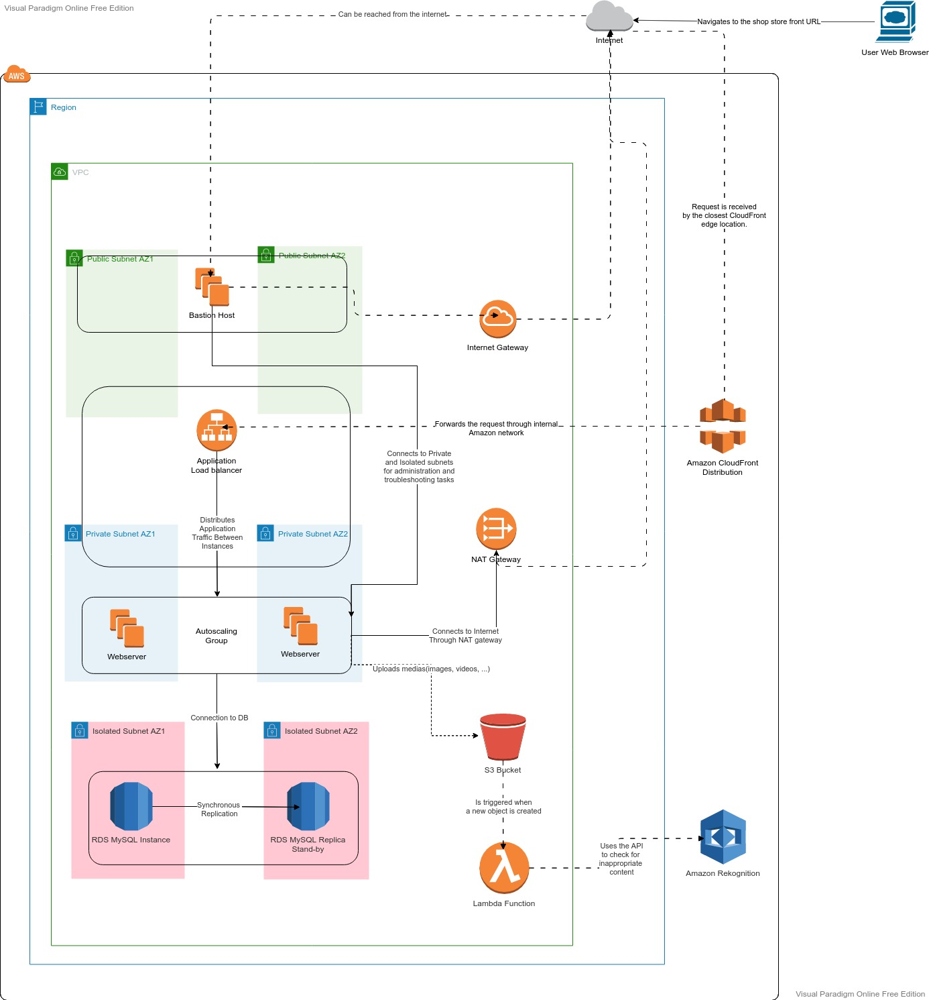

# Magento Webshop AWS CDK Project with Python

This is an AWS CDK app to provision the required resources to run a flexible, scalable and cost-effective Magento webshop on top of AWS.

### Prerequisites

- AWS Account & User - [Get help here](https://cdkworkshop.com/15-prerequisites/200-account.html)
- AWS CLI Installed & Configured - [Get help here](https://cdkworkshop.com/15-prerequisites/100-awscli.html)
- Node.js Installed - [Get help here](https://cdkworkshop.com/15-prerequisites/300-nodejs.html)
- AWS CDK Installed & Configured - [Get help here](https://cdkworkshop.com/15-prerequisites/500-toolkit.html)
- Python 3 Installed & Configured - [Get help here](https://cdkworkshop.com/15-prerequisites/600-python.html)

### Project Architecture

- A VPC that spans two Availability Zones. Each Availability Zone is configured with a private, isolated, and a public subnet.

- In a public subnet, a bastion host to provide Secure Shell (SSH) access to the Magento web servers and the internal RDS MySQL database for troubleshooting purposes.

- AWS-managed network address translation (NAT) gateways deployed into the public subnets and configured with an Elastic IP address for outbound internet connectivity. The NAT gateways are used for internet access for all EC2 instances launched within the private network.

- An Amazon RDS for MySQL database engine deployed via Amazon RDS in the isolated subnet. If you choose Multi-AZ deployment, a synchronously replicated secondary database is deployed in the second isolated subnet. This provides high availability and built-in automated failover from the primary database.

- EC2 web server instances launched in the private subnets. Elastic Load Balancing deployed to automatically distribute traffic across the multiple web server instances.

- User data scripts to automatically install the required packages and perform the required configurations.

- Elastic Load Balancing deployed to automatically distribute traffic across the multiple web server instances.

- Auto Scaling enabled to automatically increase capacity if there is a demand spike, and to reduce capacity during low traffic times.

- A CloudFront distribution is provisioned in front of the Application Load Balancer to provide caching at edge and to require encrypted web traffic through HTTPS.

- An S3 bucket to be used by the Magento installation to store users' media content.

- A Lambda function that is triggered by media content S3 bucket create item notifications. This function uses Amazon Rekognition `DetectModerationLabels` API to check for inappropriate content uploaded by users.

- IAM instance roles with fine-grained permissions for access to AWS services necessary for the resources.

- Appropriate security groups for each instance or function to restrict access to only necessary protocols and ports. For example, access to HTTP server ports on Amazon EC2 web servers is limited to Elastic Load Balancing. The security groups also restrict access to Amazon RDS DB instances by web server instances.



### Project Configuration

The project implements the use of CDK runtime contexts to dynamically create per-environment configurations and resources. Learn more (here)[https://dev.to/aws-builders/aws-cdk-per-environment-configuration-patterns-48m6].
The project defines two `dev` and `prod` environments and resources are configured depending the on that. For example, the project creates an RDS MySQL instance with minimum configuration for testing on the `dev` environment, and creates a powerful and highly available database on the `prod` environment. The environment context configuration is passed to CDK using `-c config=dev|prod`. Check out the environment specific configuration values on `cdk.json` file.

### Project Setup

This project is set up like a standard Python project. The initialization
process also creates a virtualenv within this project, stored under the `.venv`
directory. To create the virtualenv it assumes that there is a `python3`
(or `python` for Windows) executable in your path with access to the `venv`
package. If for any reason the automatic creation of the virtualenv fails,
you can create the virtualenv manually.

To manually create a virtualenv on MacOS and Linux:

```
$ python3 -m venv .venv
```

After the init process completes and the virtualenv is created, you can use the following
step to activate your virtualenv.

```
$ source .venv/bin/activate
```

If you are a Windows platform, you would activate the virtualenv like this:

```
% .venv\Scripts\activate.bat
```

Once the virtualenv is activated, you can install the required dependencies.

```
$ pip install -r requirements.txt
```

If you have multiple AWS profiles configured through AWS CLI, be sure to set which profile you want CDK to choose by executing: `export AWS_PROFILE=YOUR_PROFILE_NAME`

If this is the first time you're launching this project on your AWS account or a region, be sure to run the "bootstrap" command described below.

At this point you can now synthesize the CloudFormation template for this code. There are shell scripts to help you interact with CDK CLI and to provide your AWS account ID and the region you want to deploy this to. You must use these scripts to deploy and destroy the stacks. These scripts are:

- `cdk-run.sh` to be used on MacOS and Linux
- `cdk-run.bat` to be used on Windows(Not tested)

To add additional dependencies, for example other CDK libraries, just add
them to the `requirements.txt` file and rerun the `pip install -r requirements.txt` command.

## Useful commands

- `./cdk-run.sh AWSAccountId AWSRegion synth -c config=dev` synthesize the CloudFormation template for this code in the development environment
- `./cdk-run.sh AWSAccountId AWSRegion synth -c config=prod` synthesize the CloudFormation template for this code in the production environment
- `./cdk-run.sh AWSAccountId AWSRegion bootstrap -c config=dev` bootstraps the CDK toolkit for this porject in the development environment(needs to be run only once for each account and region)
- `./cdk-run.sh AWSAccountId AWSRegion ls -c config=dev` list all stacks in the app in the development environment
- `./cdk-run.sh AWSAccountId AWSRegion ls -c config=prod` list all stacks in the app in the production environment
- `./cdk-run.sh AWSAccountId AWSRegion synth -c config=dev` emits the synthesized CloudFormation template in the development environment
- `./cdk-run.sh AWSAccountId AWSRegion synth -c config=prod` emits the synthesized CloudFormation template in the production environment
- `./cdk-run.sh AWSAccountId AWSRegion diff -c config=dev` compare deployed stack with current state in the development environment
- `./cdk-run.sh AWSAccountId AWSRegion diff -c config=prod` compare deployed stack with current state in the production environment
- `./cdk-run.sh AWSAccountId AWSRegion deploy -c config=dev` deploy this stack to your provided AWS account/region in the development environment
- `./cdk-run.sh AWSAccountId AWSRegion deploy -c config=prod` deploy this stack to your provided AWS account/region in the production environment
- `cdk docs` open CDK documentation

**Notes:**

- You can use `cdk-run.bat` to run the commands above on Windows
- Be sure to replace `AWSAccountId` and `AWSRegion` with proper values

## Deploy it All

Run the command bellow to deploy all the stacks:

```
$ ./cdk-run.sh AWSAccountId AWSRegion deploy -c config=dev --all
```

You can choose either the `dev` or `prod` config. Just know that `prod` configuration creates more powerful, highly-available and multiple replicas of services.
It take about 15-20 minutes to provision all the resources on the `dev` environment.

!()["assets/magento-cf-dns.png"]

## Destroy it All

Run the command bellow to destroy all the stacks:

```
$ ./cdk-run.sh AWSAccountId AWSRegion destroy -c config=dev --all
```

Be sure to pass the right environment config value. S3 bucket will only get deleted if the bucket is empty.

## Testing Content Moderation for Images

Once the S3 bucket is created, you can upload a file to the bucket and wait till you see a new tag is added to your object. The tag is called `InappropriateContent` and can be set to either `true` or `false`.

## Testing Content Moderation for Videos

To be done.

## Project Testing

To be done.

## Problems with This Project

This project does not implement a mean of having a shared storage for the Magento application files so the changes in applications files are not going to reflect across multiple servers. I tried to integrate Amazon EFS with this setup to store application code but it turns out EFS is not optimized for an application with large number of small files. From the AWS support forum, it can be quotated as:

> While the distributed architecture of Amazon EFS enables high levels of availability, durability, and scalability, it results in a small latency overhead for each file operation. If the workload involves reading/writing lots of small files, the per-operation latencies can result in EFS performance being different from a local file system performance. This is why performance is degraded when dealing with small R/W IOPS – it is a limitation of the EFS architecture.

Possible solution for this problem is to use a Git repository for the application files. Anytime a change is merged to the main branch, a pipeline should trigger to pull all the latest code, build and test it. If everything goes well, the pipeline should create a new AMI based on the latest changes and deploy new EC2 instances based on the new image.
We can use EC2 Image Builder service in conjunction with any CI/CD tools to achieve this.

## ⚠️ Warning

Do NOT use this project for production use case. Please Use this only for educational purpose only and build on top of it.

Enjoy! 😎
